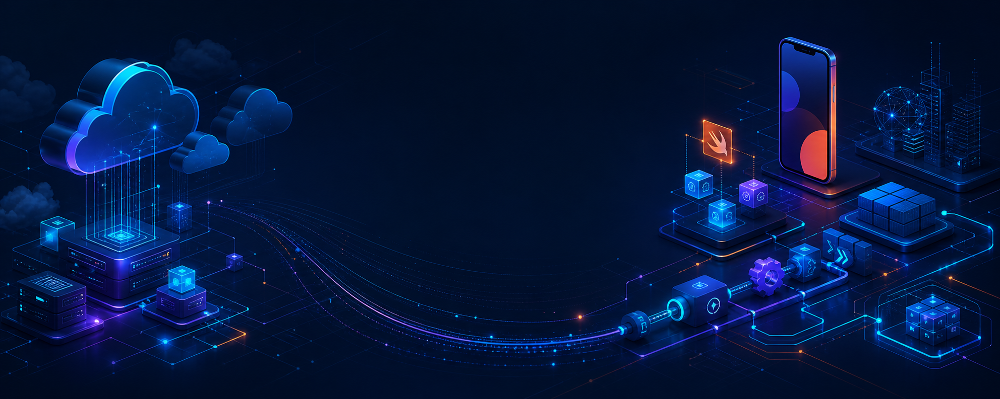

<div align="center">



# Nolan Roest

### Software Engineer · Cloud & Full-Stack Builder · Native iOS Developer


<p>
  <a href="mailto:nolan.roest@rogers.com"></a>
  <a href="https://github.com/nolanroest"></a>
  
</p>

**Software Engineering @ Western University · Class of 2027**

`Western University · London, Ontario` · `Cloud architecture` · `Native mobile` · `Technical consulting`

</div>

---

## 

I turn operational requirements into dependable software—from the interface and domain model through authentication, APIs, cloud infrastructure, and deployment. My portfolio spans serverless AWS systems, real-time React applications, native SwiftUI migration work, databases, networking protocols, and operating-system extensions.

- ☁️ I build cloud-connected applications with clear service boundaries, secure identity, and observable failure paths.
- 📱 I design native iOS experiences around lifecycle, state recovery, device capabilities, and backend-contract preservation.
- 🔄 I am especially interested in offline-first architecture, synchronization queues, connectivity-aware workflows, and resilient enterprise integration.
- 🧭 I enjoy architecture and consulting work where technical trade-offs must be made understandable to both engineers and stakeholders.
- 🎓 I am completing my Software Engineering degree in 2027 and growing this portfolio toward fourth-year and capstone work.

> **Current direction:** cloud architecture, DevOps, native mobile, secure full-stack delivery, and enterprise application modernization.

## 

### Languages & application development

<p align="center">
  
</p>

### Frontend, backend & persistence

<p align="center">
  
</p>

### Cloud, infrastructure & delivery

<p align="center">
  
</p>

<div align="center">


</div>

<details>
<summary><strong>How the toolkit maps to engineering work</strong></summary>

| Area | Verified toolkit | Portfolio evidence |
| --- | --- | --- |
| Native mobile | Swift, SwiftUI, native lifecycle and service boundaries | GridOps SwiftUI migration case study |
| Full stack | TypeScript, JavaScript, React, Node.js, Express | Kogbucks, School Operations Portal, Mastermind |
| AWS | Amplify Gen 2, Cognito, Lambda, DynamoDB, API Gateway, AppSync Events, CDK | Mastermind workshop implementation |
| Data | MySQL, SQL, Python, Streamlit, embedded persistence | Animal Watch, iFinance |
| Systems | C, TCP, binary protocols, xv6, scheduling | xv6 Sustainability Kernel, SE 3314 protocols |
| Enterprise | Authentication, SAML, SAP integration, API boundaries, CI/CD | Sanitized GridOps case studies |

</details>

## 

```text
Client experiences        Identity & APIs             Runtime & delivery
┌─────────────────┐       ┌──────────────────┐        ┌────────────────────┐
│ React · SwiftUI │ ───▶  │ Cognito · REST   │ ───▶  │ Lambda · DynamoDB  │
│ Offline state   │       │ AppSync · SAML   │        │ S3 · CloudFormation│
└─────────────────┘       └──────────────────┘        └────────────────────┘
          ▲                         │                           │
          └──────── resilient workflows · CI/CD · observability ┘
```

My cloud work centres on explicit boundaries: clients do not own infrastructure concerns, authentication is treated as a system capability, service permissions remain narrow, and deployment configuration stays separate from source. The Mastermind project provides public code evidence for an Amplify Gen 2 backend with Cognito, Lambda, DynamoDB, API Gateway, CDK constructs, and AppSync Events.

## 

<table>
<tr>
<td width="50%" valign="top">

### ☁️ [Real-Time Mastermind on AWS](https://github.com/nolanroest/DVT307_Workshop)

Serverless multiplayer game architecture built with React, TypeScript, Amplify Gen 2, Cognito, Lambda, DynamoDB, API Gateway, and AppSync Events.

`AWS` `React` `TypeScript` `Real time` `Infrastructure as code`

**Highlights:** authenticated REST boundary, event channels, DynamoDB streams, leaderboard pipeline, CDK constructs.

</td>
<td width="50%" valign="top">

### 📱 [GridOps SwiftUI Migration](https://github.com/nolanroest/gridops-swiftui-migration)

Sanitized professional case study on moving an established enterprise workflow to native iOS without exposing employer code or customer details.

`SwiftUI` `Migration architecture` `Auth recovery` `Contract preservation`

**Highlights:** parity planning, native lifecycle, service isolation, device/media workflows, cutover risk.

</td>
</tr>
<tr>
<td width="50%" valign="top">

### ⚡ [Kogbucks Auction Platform](https://github.com/nolanroest/kogbucks-auction-platform)

Full-stack marketplace with live bidding, chat, notifications, time extension, reporting, and multi-role administration.

`React` `Express` `Socket.IO` `JWT` `Vite`

**Highlights:** REST plus event channels, protected routes, auction lifecycle, portable local persistence.

</td>
<td width="50%" valign="top">

### 🛡️ [Secure Course Operations Portal](https://github.com/nolanroest/school-registration-fullstack)

Role-aware course operations system for membership, scheduling, bookings, and grading.

`React` `Express` `scrypt` `JWT` `REST`

**Highlights:** salted password hashing, enforced password change, authorization middleware, scheduling constraints.

</td>
</tr>
<tr>
<td width="50%" valign="top">

### 🌱 [Sustainability-Aware xv6](https://github.com/nolanroest/xv6-sustainability-kernel)

Teaching-kernel extension that connects environmental state to process accounting and scheduling policy.

`C` `xv6` `System calls` `Scheduling` `QEMU`

**Highlights:** four new syscalls, five-zone state model, energy ticks, mitigation-aware throttling.

</td>
<td width="50%" valign="top">

### 🐾 [Animal Watch Data System](https://github.com/nolanroest/animal-watch-database-system)

Relational wildlife-travel system with schema constraints, analytical SQL, deterministic data generation, and Streamlit workflows.

`MySQL` `SQL` `Python` `Streamlit`

**Highlights:** normalized model, synthetic portfolio data, reproducible setup, reporting queries.

</td>
</tr>
</table>

### Consulting spotlight

[**GridOps Enterprise Web Application →**](https://github.com/nolanroest/gridops-enterprise-web-application) A deliberately sanitized case study covering React/Node.js delivery, cloud boundaries, enterprise authentication, operational workflows, and stakeholder-facing architecture decisions.

## 

| Track | Current evidence |
| --- | --- |
| **B.E.Sc. Software Engineering** | Western University · expected 2027 |
| **Cloud architecture** | AWS Amplify Gen 2 workshop implementation and enterprise delivery case studies |
| **Native development** | SwiftUI migration architecture, state recovery, device integration, and service contracts |
| **Systems breadth** | xv6 kernel policy, TCP protocols, embedded C, FPGA, Java and .NET coursework |
| **Next portfolio milestones** | Fourth-year and capstone work, stronger automated testing, infrastructure documentation |

> Certification badges are intentionally omitted until a credential can be publicly verified.

## 

<div align="center">


<picture>
  <source media="(prefers-color-scheme: dark)" srcset="https://raw.githubusercontent.com/nolanroest/nolanroest/output/github-contribution-grid-snake-dark.svg" />
  <source media="(prefers-color-scheme: light)" srcset="https://raw.githubusercontent.com/nolanroest/nolanroest/output/github-contribution-grid-snake.svg" />
  
</picture>

</div>

<sub>Language cards reflect public repository bytes and are one signal—not a claim of proficiency ranking.</sub>

## 

- Deepening cloud architecture and deployment practices around AWS-managed services.
- Expanding native SwiftUI and offline-first patterns: SQLite persistence, synchronization queues, retries, and connectivity-aware UX.
- Strengthening portfolio projects with tests, threat models, diagrams, CI checks, and reproducible local environments.
- Preparing for fourth-year and capstone work in the 2026–2027 academic year.
- Targeting software engineering, cloud architecture, DevOps, native mobile, full-stack, and technical consulting opportunities.

---

<div align="center">

### Let’s build software that survives contact with the real world.

<a href="mailto:nolan.roest@rogers.com"></a>


</div>
